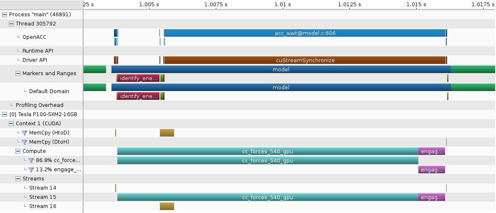

# openacc-openmp-tutorial
This is an advanced tutorial to OpenACC and OpenMP.

## Step 5
In this step we are going to 
* overlap host and device computation and communication

### Literature
* 

### Tools
* 

### Your Tasks
Below a screenshot of the NVIDIA Visual Profiler, of the timeline of a single iteration from the start of this Step 5.

As you can see, `identify_enemies` being executed on the CPU takes ~6.6ms, and including data transfers, the first execution of the GPU is only after ~7.5ms after the start of the iteration, which takes ~20ms.
So during the first ~half of the iteration, computation is done only on the CPU, the GPU being idle, and during the second ~half of the iteration, computation is done only on the GPU, the CPU being idle.
This means ~50% resource utilization.
* Using asynchroneous OpenACC parallel regions, overlap host and device computation, such that `identify_enemies` and `center+coulomb_force` run in parallel.
* Use asynchroneous data transfers and asynchroneous waits make the array `leaders[]` available to device-kernel `engange` before this kernel starts.

### Hints
* The section `tree_force` is the only remaining host-computation that changes `actions[]`, while `engage` is the only device-computation that changes `actions[].new_parent`. Since we used OpenACC to duplicate fields onto the device, that means that on host and device, seperate arrays `actions[]` are being used to accumulate forces. Exiting the OpenACC parallel region will copy back `actions[]`to the host, overwriting the host's results.
  * The two arrays need to merged properly into one host-array before the code may continue regular execution. Uncomment the commented calls to `setup_device_actions()` `merge_device_actions()`, then transfer `device_actions` instead of `actions`.
* In the end the NVIDIA Visual Profiler should show the following timeline: 

## Next Step
Continue with [Step 6](../../blob/step6/step.md)

